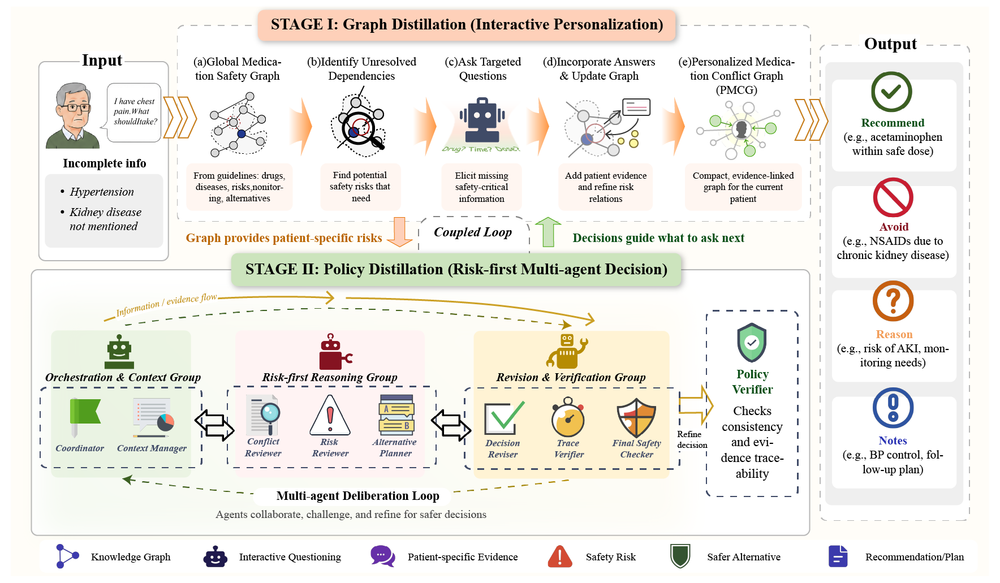
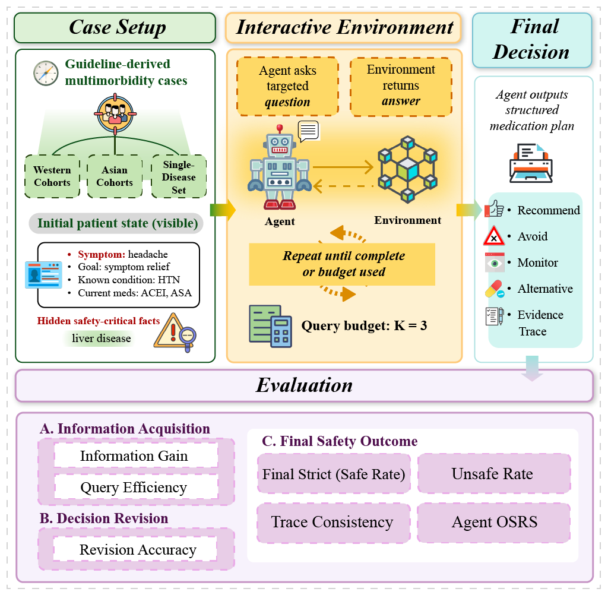
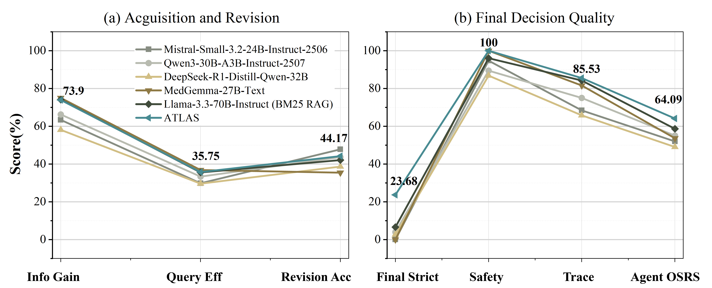
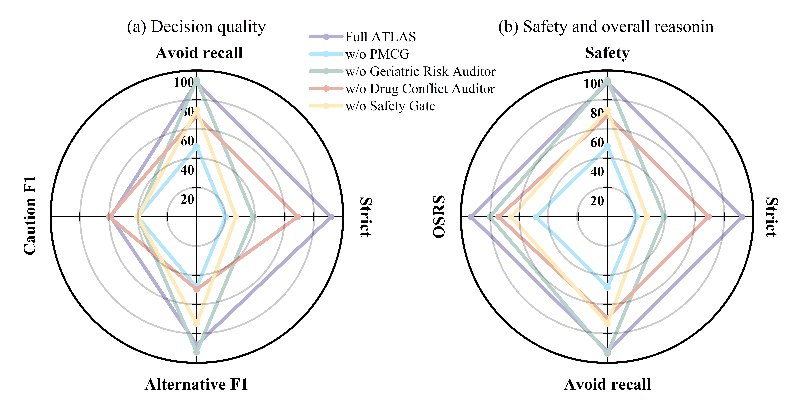
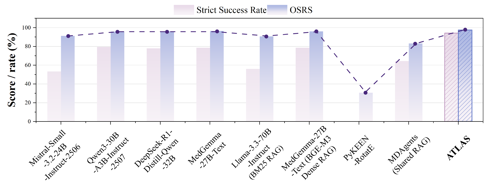

# ATLAS

### Coupled Graph–Policy Distillation for Personalized Medication Safety in Older Adults with Multimorbidity

  <strong>Zihan Wang1,*</strong>,
  <strong>Anglin Liu1,*</strong>,
  Rongyi Wang2,
  Dantong Li3,
  Yi Lu1,
  Siqing Yuan1,
  Hongxia Xu4,
  Zhongtian Long5,
  Jintai Chen1,†

  1Artificial Intelligence Thrust, The Hong Kong University of Science and Technology (Guangzhou) 
  2Faculty of Engineering, University of New South Wales 
  3Medical Big Data Center, Guangdong Provincial People’s Hospital, Southern Medical University 
  4Transvascular Implantation Devices Research Institute, Zhejiang University 
  5School of Computer Science and Technology, Huazhong University of Science and Technology, Wuhan 430074, China.

*Equal contribution. †Corresponding author.

Corresponding author: jintaiCHEN@hkust-gz.edu.cn

  
  
  
  

---

## 1.  Abstract

Large language model (LLM) agents can support medication review between clinical visits, but safe choices for older adults with multimorbidity depend on conditions, medications, and geriatric risks that users may omit. We introduce ATLAS, a coupled graph–policy distillation framework for patient-adaptive medication safety. ATLAS structures guideline evidence as a medication-safety graph. Targeted questions update the patient state and distill relevant relations into a patient-specific medication conflict graph (PMCG). A risk-first multi-agent policy uses the PMCG to screen contraindications, assess cautions and monitoring needs, identify safer alternatives, and verify the final medication plan. We also introduce GeriMedBench, an interactive benchmark that tests safety-critical information acquisition and evidence-based decision revision. Across a European non-interactive multimorbidity benchmark, an Asian interactive multimorbidity benchmark, and an Asian non-interactive cross-guideline benchmark, ATLAS achieves the strongest complete-decision performance among the compared systems. On the European non-interactive multimorbidity benchmark, it exceeds the strongest proprietary LLM baseline by 53.73 points in Strict Success Rate and 14.63 points in overall safety reasoning score (OSRS), with no unsafe recommendations under the automated evaluator. A blinded clinician evaluation gives ATLAS higher mean ratings across all five criteria and flags potentially unsafe recommendations in one ATLAS case and two Gemini cases.

**Index Terms—**medication safety, multimorbidity, large language model agents, multi-agent systems, knowledge graphs, geriatric care

---

## 2.  INTRODUCTION

Medication safety for older adults with multimorbidity depends on clinical facts that an initial query may omit. A user may describe a symptom or treatment goal without reporting a condition, medication, or geriatric risk that changes the safety of a candidate treatment. An agent that treats the first message as a complete patient profile can produce a plausible but unsafe recommendation. Figure 1 illustrates this gap. Safe medication decision support must identify decision-changing information, ask focused questions, and revise the medication plan as new evidence emerges. ATLAS supports clinician and pharmacist judgment rather than replacing it [1].

  

  <em>Fig. 1. One-shot medication advice versus ATLAS. A black-box LLM may miss unreported risks, while ATLAS elicits missing information, updates the patient-specific medication conflict graph (PMCG), and supports an evidence-grounded decision through safety-first reasoning.</em>

---

## 3.  METHOD

ATLAS treats medication decision support as an evidence-based consultation. It updates a structured patient state, distills relevant guideline relations into a PMCG, and executes a risk-first policy over the graph. The PMCG identifies unresolved safety dependencies. The policy selects questions, revises affected decisions, and verifies the final medication plan. Figure 2 summarizes graph distillation and risk-first policy execution.

  

  <em>Fig. 2. ATLAS architecture. The graph branch updates an evolving PMCG through targeted questioning. The policy branch executes the distilled risk-first policy to assess conflicts, risks, alternatives, and recommendations, then verifies the final medication plan. The three agent groups correspond to the three functional layers defined in the text. The output panel illustrates an example report rather than the full evaluation schema, which contains recommendation, avoidance, caution, and alternative components.</em>

---

## 4.  GeriMedBench: Interactive Medication Safety Benchmark

GeriMedBench frames medication safety as an interactive task rather than a decision based on a complete patient profile. Each case provides an initial public state, hidden safety-critical facts that may change the decision, a response environment, and a guideline-grounded reference. As Figure 3 shows, the agent interacts with the environment under a limited query budget before producing a structured medication-safety decision [21].

  

  <em>Fig. 3. GeriMedBench, an interactive medication-safety benchmark. The case-setup panel summarizes the evaluation sets, while only the Asian Multimorbidity Evaluation Set uses the interactive protocol. Under this protocol, an agent queries an incomplete patient state with hidden safety facts and revises its final decision under a budget of K = 3.</em>

---

## 5.  EXPERIMENTS AND RESULTS

We evaluate ATLAS on a European non-interactive multimorbidity benchmark, an Asian interactive multimorbidity benchmark, and an Asian non-interactive cross-guideline benchmark. The experiments measure complete medication decisions, safety, evidence acquisition, targeted revision, component contributions, and cross-guideline robustness.

### 5.1  Results on the Western Multimorbidity Evaluation Set

Table I reports results on the European non-interactive multimorbidity benchmark. ATLAS achieves 92.04% Strict Success and an OSRS of 97.21. It exceeds the best non-ATLAS results by 53.73 points in Strict Success and 14.63 points in OSRS, with no unsafe recommendations under the automated evaluator. Strict Success measures joint correctness rather than an equal gain in every decision component. Several baselines remain competitive on individual components, but ATLAS completes the full structured decision more often.

| Method | Strict Success | Mrec F1 | Mavoid Recall | Mcaution F1 | Malt F1 | Unsafe Rate | OSRS |
|---|---:|---:|---:|---:|---:|---:|---:|
| **Foundation Models** |  |  |  |  |  |  |  |
| Mistral-Small-3.2-24B | 2.49 | 78.44 | 87.56 | 42.29 | 9.95 | 12.44 | 63.36 |
| Qwen3-30B-A3B | 16.42 | 26.37 | 98.01 | 62.19 | 65.17 | 1.99 | 70.85 |
| DeepSeek-R1-Distill-Qwen-32B | 26.87 | 85.41 | 95.52 | 43.78 | 53.73 | 3.48 | 74.58 |
| MedGemma-27B-Text | 1.99 | 60.36 | 92.54 | 57.21 | 6.47 | 7.46 | 65.37 |
| GPT-5 | 32.34 | 69.15 | 99.00 | 41.29 | 49.12 | 0.50 | 71.37 |
| Claude Opus 4.6 | 34.83 | 88.56 | 98.01 | 46.77 | 85.32 | **0.00** | 82.30 |
| Gemini 3.1 Pro Preview | 38.31 | 63.68 | 99.00 | 70.65 | 80.60 | **0.00** | 82.58 |
| **Knowledge-Augmented Models** |  |  |  |  |  |  |  |
| Llama-3.3-70B-Instruct | 0.00 | 79.60 | 96.52 | 51.74 | 1.00 | **0.00** | 68.82 |
| RotatE | 0.00 | 30.85 | 13.43 | 20.40 | 0.00 | 62.69 | 28.26 |
| **Multi-Agent Systems** |  |  |  |  |  |  |  |
| MDAgents | 6.97 | 32.34 | 93.53 | **79.60** | 7.13 | **0.00** | 69.42 |
| **Ours** |  |  |  |  |  |  |  |
| **ATLAS** | **92.04** | **92.50** | **100.00** | 75.47 | **92.84** | **0.00** | **97.21** |
| Δ vs. Best | ↑53.73 | ↑3.94 | ↑1.00 | ↓4.13 | ↑7.52 | 0.00 | ↑14.63 |

  <em>TABLE I. MAIN RESULTS ON THE WESTERN MULTIMORBIDITY EVALUATION SET (N = 201). VALUES ARE PERCENTAGES EXCEPT OSRS. BEST VALUES ARE BOLD. ARROWS IN THE Δ ROW INDICATE THE DIRECTION OF CHANGE RELATIVE TO THE BEST NON-ATLAS RESULT.</em>

---

### 5.2  GeriMedBench on the Asian Multimorbidity Evaluation Set

Table II reports the detailed quantitative results, while Figure 5 summarizes the corresponding performance profiles on the Asian interactive multimorbidity benchmark. ATLAS achieves the highest Revision Accuracy of 44.17%, Final Strict of 23.68%, Trace Consistency of 85.53%, and Agent OSRS of 64.09, with no unsafe recommendations under the automated evaluator. The Final Strict and Revision Accuracy scores expose the remaining challenges in information acquisition and decision revision. Although ATLAS outperforms the compared systems, these results leave substantial room for improvement.

| Method | Revision Acc. ↑ | Final Strict ↑ | Trace Consistency ↑ | Unsafe Rate ↓ | Agent OSRS ↑ |
|---|---:|---:|---:|---:|---:|
| **Foundation Models** |  |  |  |  |  |
| Qwen3-30B-A3B | 43.69 | 3.95 | 75.00 | 10.53 | 55.03 |
| DeepSeek-R1-Distill-Qwen-32B | 38.64 | 2.63 | 65.79 | 13.16 | 49.03 |
| MedGemma-27B-Text | 35.43 | 0.00 | 81.58 | **0.00** | 53.63 |
| GPT-5 | 40.60 | 2.63 | 81.58 | **0.00** | 58.98 |
| Claude Opus 4.6 | 40.51 | 5.26 | 81.58 | **0.00** | 62.87 |
| Gemini 3.1 Pro Preview | 43.18 | 7.89 | 73.68 | 2.63 | 60.54 |
| **Knowledge-Augmented Models** |  |  |  |  |  |
| Llama-3.3-70B-Instruct | 42.11 | 6.58 | 84.21 | 3.95 | 58.63 |
| **Ours** |  |  |  |  |  |
| **ATLAS** | **44.17** | **23.68** | **85.53** | **0.00** | **64.09** |
| Δ vs. Best | ↑0.48 | ↑15.79 | ↑1.32 | 0.00 | ↑1.22 |

  <em>TABLE II. GERIMEDBENCH RESULTS ON THE ASIAN MULTIMORBIDITY EVALUATION SET (N = 76, K = 3). VALUES ARE PERCENTAGES EXCEPT AGENT OSRS. BEST VALUES ARE BOLD. THE FINAL ROW REPORTS DIFFERENCES BETWEEN ATLAS AND THE BEST NON-ATLAS RESULT IN EACH COLUMN.</em>

  

  <em>Fig. 4. GeriMedBench performance on the Asian Multimorbidity Evaluation Set (N = 76, K = 3). Safety is defined as 100 minus the Unsafe Rate. ATLAS is highlighted in blue. Rates are reported as percentages, while Agent OSRS is reported on a 0–100 scale.</em>

---

### 5.3  Core safety-reasoning ablations

Figure 4 shows that each safety component protects a different part of the decision. Removing PMCG personalization reduces Strict Success from 92.04% to 19.90%, lowers OSRS from 97.21 to 48.78, and raises Unsafe Rate to 51.74%. Removing the Geriatric Risk Auditor lowers Mcaution F1 to 40.30%. Removing the Drug Conflict Auditor lowers Mavoid Recall to 69.15% and raises Unsafe Rate to 30.85%. Removing the Safety Gate reduces Strict Success from 92.04% to 26.87% and increases the Unsafe Recommendation Rate from 0% to 26.87%.

  

  <em>Fig. 5. Core safety-reasoning ablations. Panel (a) compares decision-quality metrics, whereas Panel (b) summarizes safety and overall performance. Full ATLAS is compared with four component ablations. Safety is defined as 100 − Unsafe Recommendation Rate.</em>

---

### 5.4  Blinded clinician evaluation.

Table III complements the automated results with blinded clinician judgments. ATLAS receives higher mean scores than Gemini 3.1 Pro Preview for clinical correctness, medication safety, decision completeness, actionability, and evidence consistency. Case-level majority judgments prefer ATLAS in 28 cases, Gemini in 5 cases, and report 7 ties. Reviewers flag potentially unsafe recommendations in 1 ATLAS case and 2 Gemini cases. Ordinal Krippendorff’s α ranges from 0.33 to 0.71 across the five criteria. These results support the expert-rated clinical quality of ATLAS outputs within the reviewed sample. They do not establish real-world clinical effectiveness.

| Method | Correct. | Safety | Complete. | Action. | Evidence | Unsafe |
|---|---:|---:|---:|---:|---:|---:|
| Gemini 3.1 Pro Preview | 3.77 | 4.12 | 3.67 | 3.85 | 3.80 | 2/40 |
| **ATLAS** | **4.11** | **4.35** | **4.01** | **4.01** | **4.08** | **1/40** |

  <em>TABLE III. BLINDED CLINICIAN EVALUATION ON 40 BENCHMARK-STRATIFIED CASES. SCORES USE A FIVE-POINT SCALE AND AVERAGE ALL REVIEWER–CASE RATINGS. UNSAFE CASES USE CASE-LEVEL MAJORITY JUDGMENTS.</em>

---

### 5.5  Cross-Regional Single-Disease Generalization Set

The Asian non-interactive cross-guideline benchmark tests medication-safety performance outside the multimorbidity settings. As shown in Figure 6, ATLAS achieves the highest Strict Success Rate of 94.12%, exceeding Gemini 3.1 Pro Preview by 1.52 percentage points. ATLAS also records an overall safety reasoning score of 97.55, within 0.29 points of Gemini’s best score of 97.84 and above all other methods. These results show that ATLAS delivers the strongest complete-decision performance while maintaining strong overall safety reasoning across guideline sources.

  

  <em>Fig. 6. Single-disease comparison on the Cross-Regional Single-Disease Generalization Set (N = 612), showing Strict Success Rate and OSRS across methods. Rates are reported as percentages, while OSRS is reported on a 0–100 scale.</em>

---

## 6.  CONCLUSION

We present ATLAS, a coupled graph–policy distillation framework for medication safety in older adults with multimorbidity. ATLAS identifies missing safety information, updates a PMCG, and revises decisions that depend on new evidence. A symbolic risk-first policy guides conflict screening, caution assessment, alternative selection, and final verification. We also introduce GeriMedBench to test safety-critical information acquisition and evidence-based revision. Across a European non-interactive multimorbidity benchmark, an Asian interactive multimorbidity benchmark, and an Asian non-interactive cross-guideline benchmark, ATLAS achieves the strongest complete-decision performance among the compared systems and records no unsafe recommendations under the automated evaluator. A small blinded clinician evaluation gave ATLAS higher mean ratings across all five criteria and fewer majority-flagged unsafe cases than Gemini. These results support graph-guided questioning and evidence-based revision across the tested settings. They do not establish real-world clinical effectiveness.
